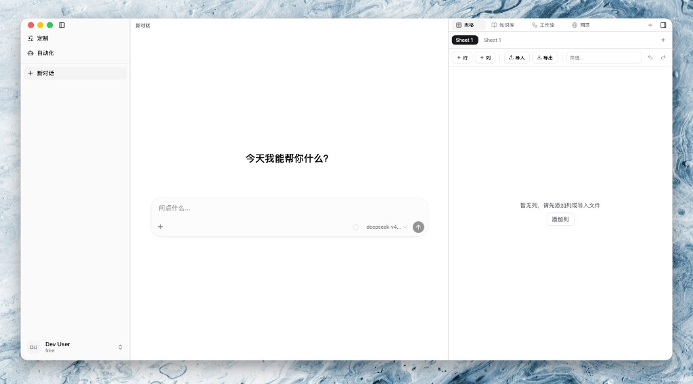

# Veylin

[English](./README.md) · 简体中文

> 开源、本机自托管的 **通用 AI Agent 桌面平台**。具备 Claude Code 级 agent 循环（工具调用、计划模式、子智能体、Skills、Hooks），以及可 DIY 的统一工作区（表格 / 知识库 / 工作流 / 网页），方便在清晰的 monorepo 架构上二次做成领域应用。双击即用，无需 Docker / Postgres / Redis。

<p>
  <a href="./LICENSE"></a>
  
  
  
  
</p>



## 适合谁

- 需要 **本地、隐私优先** 的 Agent，又不想自建一整套云端基础设施
- 希望开箱即用 **Claude Code 式能力**（计划模式 / 子智能体 / Skills / Hooks / MCP）
- 要在稳定平台上 **DIY 垂直应用**（面板、`agent.yaml`、插件），而不是从聊天壳从头造轮子

## 为什么是 Veylin

1. **Claude Code 级 agent 循环** — 工具调用、计划模式、Goal/Loop、子智能体（`task`）、Skills、Hooks、审批门、上下文压缩，而不是「只有对话框」。
2. **为二次开发而设计** — Skills / Rules / MCP / Hooks / Plugins 与 `agent.yaml` 可定制；右侧面板（表格 · 知识库 · 工作流 · 网页）与 Settings API 可扩展，不必改壳。
3. **零运维本机栈** — Tauri 桌面 + Node sidecar + 嵌入式 SurrealDB（文档 + 图 + 向量 + 全文）。终端用户无需单独安装 Node / Docker / 数据库。

## 和同类项目比

| 类型 | 代表 | Veylin |
|------|------|--------|
| IDE / CLI coding agent | Cline、Aider、Continue、OpenCode | **不是** VS Code 插件；写代码只是场景之一，产品是 **桌面 Agent 工作区** |
| 自治 coding 平台 | OpenHands、Goose | 更偏 **本机桌面 + 业务面板**（表 / RAG / 工作流），而非 Docker 沙箱出 PR |
| 聊天 / RAG 壳 | Dify、Open WebUI、AnythingLLM | 更完整的 **agent 运行时**（计划、子智能体、hooks、skills、策略）+ 同一套 DIY 面 |

## 功能

### Agent

- OpenAI-compatible 模型流式对话（自备 Key）
- 计划模式、Todos、向用户提问、Goal / Loop
- 子智能体与预设（explore / plan / general-purpose 等）
- 动态工具发现（`tool_search`）：表格、知识库、工作流、配置、agent 工具
- 上下文工程：分层 system prompt、微压缩、LLM compaction

### 定制与扩展

- **Skills** — bundled / user / plugin；Composer 中激活
- **Rules** — always / keyword 注入 system prompt
- **MCP** — 远程 SSE/HTTP；变更后刷新工具集
- **Hooks** — 兼容 Claude Code 生命周期事件（user / project / plugin）
- **Plugins** — path / git / marketplace；可捆绑 skills + hooks + MCP  
  详见 [docs/hooks-skills-plugins.md](./docs/hooks-skills-plugins.md) 与 [examples/](./examples/)

### 自动化

- 定时（cron）与事件 Webhook（HMAC + JMESPath）
- 右侧面板可视化 **工作流** DAG（agent / 知识库 / 表格 / HTTP 等节点）

### 工作区面板

表格 · 知识库（RAG + 图谱）· 工作流 · 网页 — 同一壳，Agent 可调用对应工具。

## 架构

```
Tauri 壳 (apps/desktop)
  └─ React + assistant-ui (apps/web)
        └─ Fastify BFF sidecar (apps/server)
              └─ Runtime (packages/runtime) ── Mastra agents / memory / processors
                    ├─ 工具 + MCP (packages/tools, …)
                    ├─ 策略 (packages/policy)
                    ├─ Hooks (packages/hooks)
                    ├─ 嵌入式 SurrealDB (packages/db)
                    └─ LibSQL ── 线程 transcript + 语义召回
```

| 包 | 职责 |
|----|------|
| `@veylin/shared` | 类型、zod、workflow / goal 契约 |
| `@veylin/db` | 嵌入式 SurrealDB + 表 / RAG / 工作流仓储 |
| `@veylin/runtime` | Agent 组装、memory、prompts、子智能体预设 |
| `@veylin/tools` | 内置工具 + `tool_search` |
| `@veylin/policy` | 风险分级、审批、计划模式白名单 |
| `@veylin/hooks` | Hook 总线 / 加载器 |
| `@veylin/agent-package` | `agent.yaml` + skills 加载 |
| `@veylin/server` | Fastify BFF + sidecar 打包 |
| `@veylin/web` | React UI |
| `apps/desktop` | Tauri 壳 + sidecar 生命周期 |

更多：[docs/architecture.md](./docs/architecture.md)。

## 本地启动（开发）

```bash
cp .env.example .env          # 填模型 key
npm install
npm run dev                   # server :8787 + web :5174
# 或桌面：
npm run -w @veylin/desktop dev
```

数据目录由 `VEYLIN_DATA_DIR` 指定（开发默认仓库内 `./data`）。桌面免登录：`VEYLIN_DESKTOP_AUTH=1`。

## 打包桌面应用

```bash
npm run -w @veylin/desktop build
```

产物在 `apps/desktop/src-tauri/target/release/bundle/`（dmg / msi / AppImage / deb）。安装版数据默认在系统应用数据目录（如 macOS Application Support），可用 `VEYLIN_DATA_DIR` 覆盖。

安装包**不内置模型凭据** — 首次聊天前在 **设置 → 模型** 配置 API Key。

## 上下文工程（摘要）

- **System prompt 分层**：静态 instructions 与每轮动态块（技能、规则、RAG 等）分开组装
- **微压缩**：旧的大工具结果可替换为占位，保留近轮完整输出
- **Compaction**：历史超阈值时摘要较早消息（可按 context window 比例自动触发）

环境变量见 `.env.example` 中 Context engineering 一节。

## 安全

见 [SECURITY.md](./SECURITY.md)。共享或生产部署请设置 `AUTH_SECRET`，并关闭桌面免登录。

## 贡献

见 [CONTRIBUTING.md](./CONTRIBUTING.md)。

## License

[MIT](./LICENSE) © Veylin contributors
